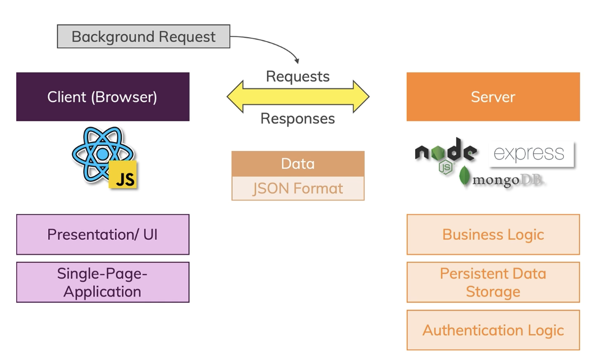
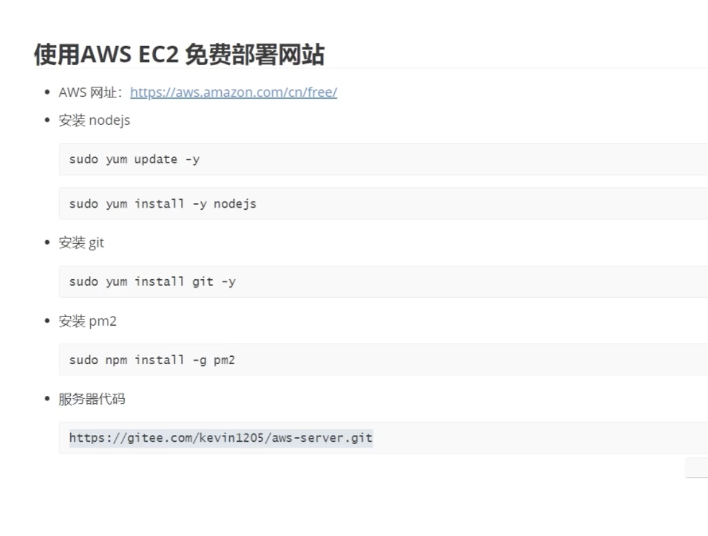

## 1. MERN


## 2. Big Picture




In such cases it will help to replace (in `package.json`) ...

```
"start": "react-scripts start" 
```

... with ...

```
"start": "react-scripts --openssl-legacy-provider start"
```

... and ...

```
"build": "react-scripts build" 
```

... with ...

```
"build": "react-scripts --openssl-legacy-provider build"
```

​    *"start"*: "react-scripts --openssl-legacy-provider start",

​    *"build"*: "react-scripts --openssl-legacy-provider build",

==shift + option + F== : prettier auto formatting

## 3. React.js

### 1) props

### 2) state

### 3) components

### 4) hooks




sudo yum install tmux

